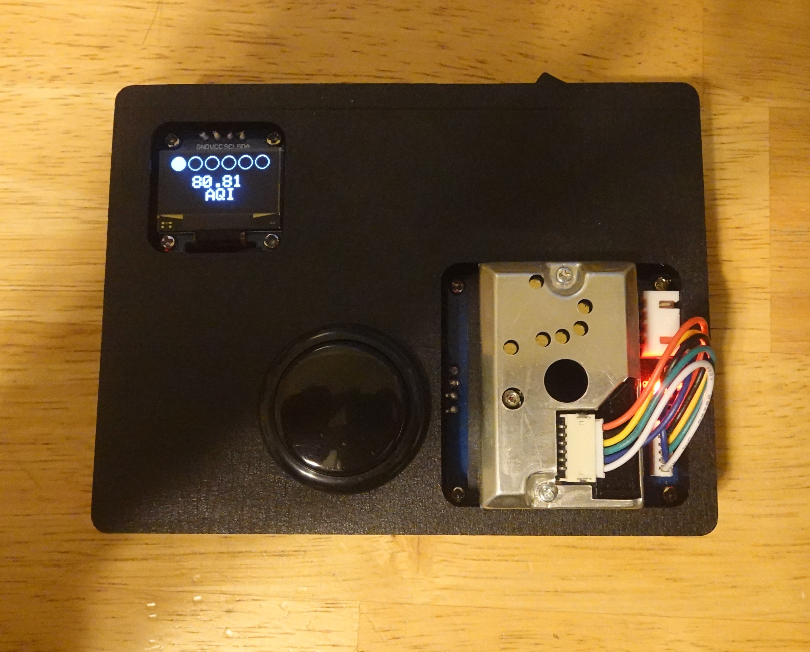

# PM Sensor

A simple particulate matter (PM) sensor built around the Sharp GP2Y1010AU0F.

I programmed a small display to output a rough measure of the AQI every few seconds. Small filled circles indicate the "badness" of the air quality. One filled circle is the best possible air, while all six filled means the worst possible sensor. More details about the sensor behavior can be found in the `Dust-Sensor-User-Manual-EN.pdf` file in the `waveshare_dust_sensor` folder.

The brains of the device is an Arduino Pro Mini clone. It uses a small 1S lipo battery, connected to a lipo battery charger/discharger circuit to power the system. The charging/discharging PCB also regulates the voltage to 5V. A toggle switch is also directly connected to one of the leads to the battery as a "master off" switch. A momentary switch must turn on the battery charge/discharge circuit, while the master switch regulates power from the battery. If this seems strange for this usecase, that's because it is. The battery charge/discharge circuit is needlessly complicated since it also allows power from a micro USB port. But hey, ultimately, it works.

To be honest, the sensor isn't very accurate at all. It might be better used on a long time baseline measurements, eg. the average AQI for the whole day. I measure spikes from this sensor all the time and the AQI sometimes gives nonsensical readings.

Photo of the finished product:

A short list of materials:
https://www.amazon.com/gp/product/B01JA58DHM/
https://www.amazon.com/gp/product/B07HVSZ15G/
https://www.amazon.com/gp/product/B07PZT3ZW2/
https://www.amazon.com/Waveshare-Dust-Sensor-GP2Y1010AU0F-Conditioner/dp/B07P94LCFZ/
https://www.amazon.com/gp/product/B07NWD5NTN/
